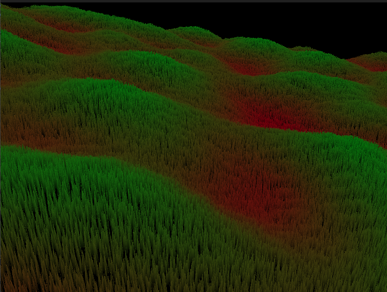

# FerrousGL

<a href="">Documentation</a><br>
<a href="">Examples</a><br>
<a href="">Website</a>

**FerrousGL** is a high performance and simple-to-use Rust library for OpenGL rendering. It offers straightforward ways to handle a window, rendering, shaders, textures and meshes. This makes the development fast and clean.

It aims to support all commonly know OpenGL functionalities, such as the previously mentioned as well as more complicated things like custom render targets, other shader types, different buffer types and instanced rendering.

To use FerrousGL in your projects, just add it into your `Cargo.toml` like this:

```toml
[dependencies]
ferrousgl = "0.1.0"
```

## Current Features
- Instanced Rendering
- Fragment, Vertex, Compute, Geometry (untested) Shaders
- Window with configuration and selectable OpenGL versions
- More on the way

## Examples
Rendering 1,048,576 blades of grass (each 5 polygons) smoothly on an RTX 3050

